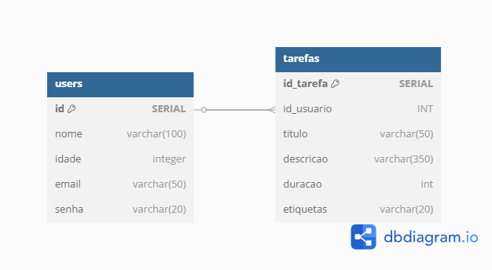
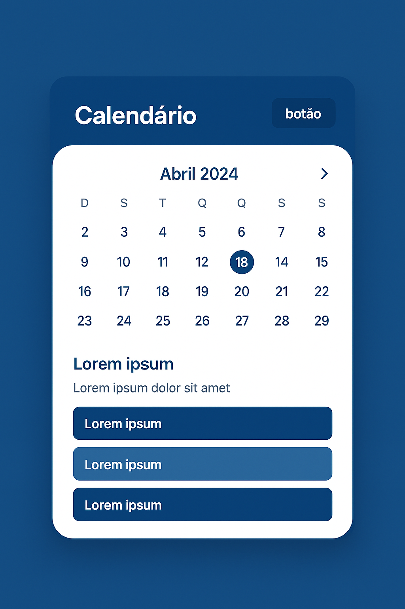
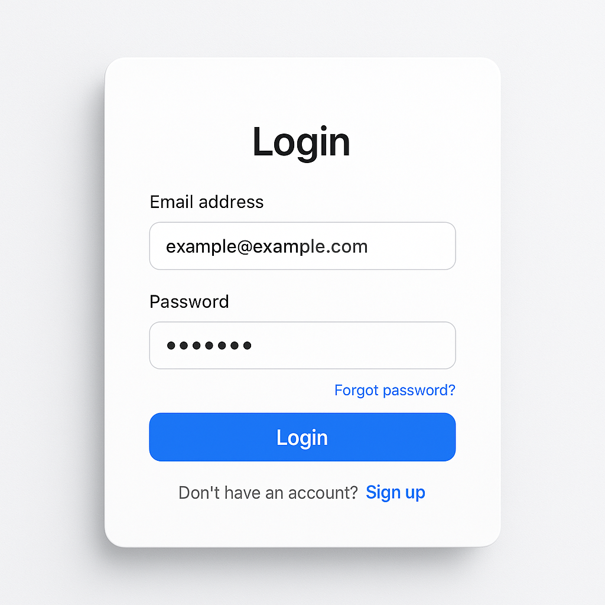

# Web Application Document - Projeto Individual - Módulo 2 - Inteli

**_Os trechos em itálico servem apenas como guia para o preenchimento da seção. Por esse motivo, não devem fazer parte da documentação final._**

## Nome do Projeto

Base Data

#### Autor do projeto

Patrick Natan Murachovsky

## Sumário

1. [Introdução](#c1)  
2. [Visão Geral da Aplicação Web](#c2)  
3. [Projeto Técnico da Aplicação Web](#c3)  
4. [Desenvolvimento da Aplicação Web](#c4)  
5. [Referências](#c5)  

 

## 1. Introdução (Semana 01)

Introdução: Opção 1: Gerenciador de tarefas para organização e produtividade.

Este projeto visa desenvolver uma Agenda Online, pra que os usuários organizem seus compromissos de modo prático e acessível. A ideia é fazer um sistema simples, com uma interface amigável, onde o usuário possa adicionar, editar, ou remover eventos do cotidiano, e também ver seus compromissos de várias formas (diária, semanal, mensal).

A agenda foi idealizada especialmente para gente com rotinas beem cheias, precisando otimizar tempo, tipo estudantes, profissionais independentes, e aqueles trabalhadores cheios de atividade.
---

## 2. Visão Geral da Aplicação Web

### 2.1. Personas (Semana 01)

Nome: Mariana Ribeiro
Idade: 29 anos
Ocupação: Arquiteta freelancer

Hábitos digitais:

Usa o celular constantemente para responder clientes via WhatsApp e e-mail

Costuma trabalhar com o Google Calendar, mas acha confuso

Utiliza aplicativos como Notion e Trello, mas sente que são "pesados" para sua rotina

Necessidades:

Ter uma visão clara e rápida da agenda do dia e da semana

Organizar reuniões com clientes e prazos de entrega

Ser lembrada de compromissos importantes com notificações

Dores:

Esquece compromissos por falta de lembretes

Se sente perdida entre diferentes ferramentas e aplicativos

Perde tempo tentando organizar a rotina em sistemas complexos

Solução:
O sistema proposto oferece uma Agenda Online simples e eficiente, que permite a Mariana visualizar seus compromissos rapidamente, cadastrar novos eventos com poucos cliques, e configurar lembretes personalizados. Com isso, ela consegue manter seu dia organizado, evitar esquecimentos e focar mais nos seus projetos criativos.

### 2.2. User Stories (Semana 01)

US01:
Como usuária,
eu quero adicionar um novo compromisso com data e hora
para organizar meus eventos e não esquecer prazos importantes.

US02:
Como usuária,
eu quero visualizar meus compromissos em um calendário semanal
para ter uma visão geral da minha agenda e me planejar melhor.

US03:
Como usuária,
eu quero receber notificações antes dos meus compromissos
para garantir que não me esqueça de nenhum evento.

US04:
Como usuária,
eu quero editar ou excluir compromissos cadastrados
para manter minha agenda sempre atualizada.

US05:
Como usuária,
eu quero poder acessar a agenda pelo celular e pelo computador
para gerenciar meus compromissos de qualquer lugar.

---

## 3. Projeto da Aplicação Web

### 3.1. Modelagem do banco de dados  (Semana 3)

*Posicione aqui os diagramas de modelos relacionais do seu banco de dados, apresentando todos os esquemas de tabelas e suas relações. Utilize texto para complementar suas explicações, se necessário.*

As relações entre as tabelas do banco de dados são entre as informações do usuário e as tarefas, sendo assim o usuário coloca suas informações como, nome, email, idade. Com isso essas informações são salvas e as tarefas que devem ser realizadas serão atribuídas ao utilizador.

*Posicione também o modelo físico com o Schema do BD (arquivo .sql)*

### 3.1.1 BD e Models (Semana 5)
*Descreva aqui os Models implementados no sistema web*

O model User é responsável por realizar as operações de CRUD (Create, Read, Update, Delete) na tabela users do banco de dados. Ele utiliza métodos estáticos e executa consultas SQL de forma segura, utilizando placeholders para evitar SQL Injection.

Métodos disponíveis:
getAll(): Retorna todos os usuários cadastrados. Executa a consulta SELECT * FROM users; e retorna um array com os objetos representando cada usuário.

getById(id): Retorna um usuário específico de acordo com o id fornecido. Executa a consulta SELECT * FROM users WHERE id = $1; e retorna o objeto do usuário encontrado ou undefined caso não exista.

create(data): Insere um novo usuário no banco de dados com os dados informados. O parâmetro data deve conter as propriedades nome, idade, email e senha. Executa a consulta INSERT INTO users (nome, idade, email, senha) VALUES ($1, $2, $3, $4) RETURNING *; e retorna o objeto do usuário recém-criado.

update(id, data): Atualiza as informações de um usuário com base no id. O data deve conter as propriedades nome, idade, email e senha. Executa a consulta UPDATE users SET nome = $1, idade = $2, email = $3, senha = $4 WHERE id = $5 RETURNING *; e retorna o objeto atualizado.

delete(id): Remove um usuário com base no id. Executa a consulta DELETE FROM users WHERE id = $1 RETURNING *; e retorna true se um registro foi excluído ou false caso não tenha sido encontrado.

### 3.2. Arquitetura (Semana 5)

*Posicione aqui o diagrama de arquitetura da sua solução de aplicação web. Atualize sempre que necessário.*

**Instruções para criação do diagrama de arquitetura**  
- **Model**: A camada que lida com a lógica de negócios e interage com o banco de dados.
- **View**: A camada responsável pela interface de usuário.
- **Controller**: A camada que recebe as requisições, processa as ações e atualiza o modelo e a visualização.
  
*Adicione as setas e explicações sobre como os dados fluem entre o Model, Controller e View.*

### 3.3. Wireframes (Semana 03)

file:///C:/Users/murac/Downloads/Wireframes%20Baixa%20Fidelidade.pdf 

### 3.4. Guia de estilos (Semana 05)

*Descreva aqui orientações gerais para o leitor sobre como utilizar os componentes do guia de estilos de sua solução.*

As orientações para fazer o uso adequado da plataforma Base Data que tem como o seu principal objetivo, gerenciar as tarefas do usúario e entregar uma melhor organização pessoal, para o utilizador. Para fazer o uso correto, a pessoa deve, ter um breve conhecimento de como utilizar computadores e celulares, e também, esclarescer bem suas tarefas para a plataforma organizar - las e entregar uma boa organização.

### 3.5. Protótipo de alta fidelidade (Semana 05)

*Posicione aqui algumas imagens demonstrativas de seu protótipo de alta fidelidade e o link para acesso ao protótipo completo (mantenha o link sempre público para visualização).*

### 3.6. WebAPI e endpoints (Semana 05)

*Utilize um link para outra página de documentação contendo a descrição completa de cada endpoint. Ou descreva aqui cada endpoint criado para seu sistema.*  

### 3.7 Interface e Navegação (Semana 07)

*Descreva e ilustre aqui o desenvolvimento do frontend do sistema web, explicando brevemente o que foi entregue em termos de código e sistema. Utilize prints de tela para ilustrar.*

---

## 4. Desenvolvimento da Aplicação Web (Semana 8)

### 4.1 Demonstração do Sistema Web (Semana 8)

*VIDEO: Insira o link do vídeo demonstrativo nesta seção*
*Descreva e ilustre aqui o desenvolvimento do sistema web completo, explicando brevemente o que foi entregue em termos de código e sistema. Utilize prints de tela para ilustrar.*

### 4.2 Conclusões e Trabalhos Futuros (Semana 8)

*Indique pontos fortes e pontos a melhorar de maneira geral.*
*Relacione também quaisquer outras ideias que você tenha para melhorias futuras.*

## 5. Referências

_Incluir as principais referências de seu projeto, para que seu parceiro possa consultar caso ele se interessar em aprofundar. Um exemplo de referência de livro e de site:_ 

---
---
